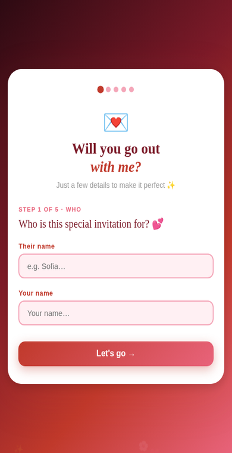
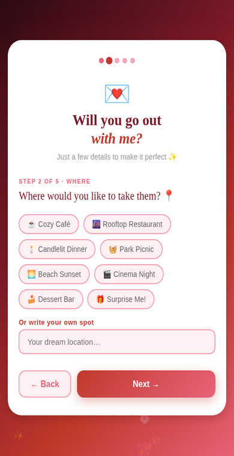
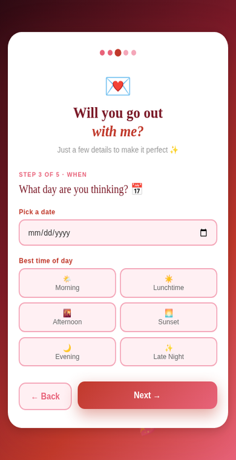
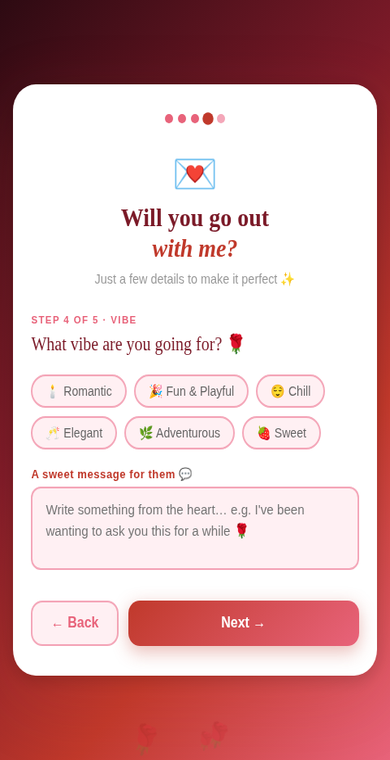
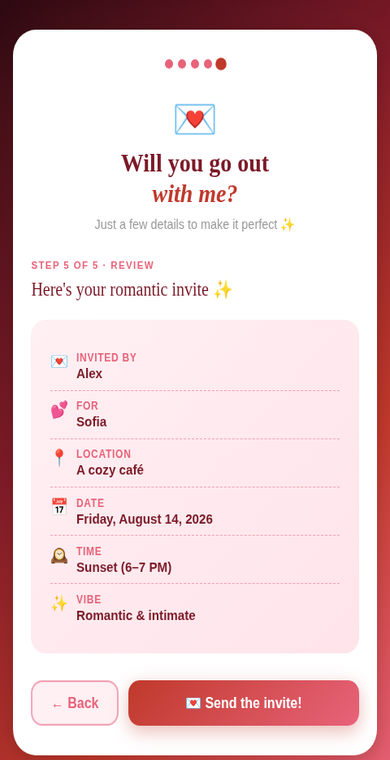
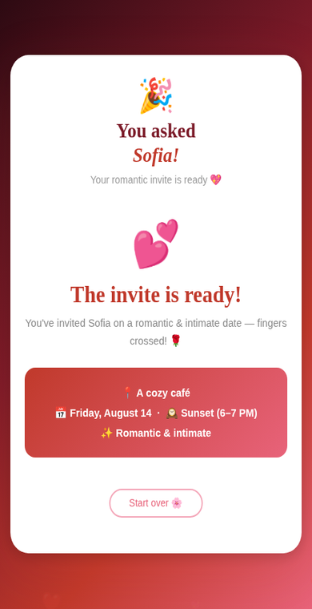

# 💕 Ask Me Out

A beautiful Flutter application for creating and sending a romantic date invitation in a fun, interactive, and memorable way.

---

## ✨ Overview

**Ask Me Out** is a charming multi-step Flutter experience designed to help users create a personalized romantic date invitation.

With smooth animations, elegant pink and crimson gradients, floating hearts, and a guided step-by-step flow, the app transforms a simple invitation into a delightful experience.

The user is guided through selecting who they are inviting, where the date will take place, when it will happen, and the overall vibe of the invitation before reviewing everything and sending the final request.

---

## 📱 Screenshots

### 💌 Step 1 — Who

Enter the name of the person you would like to invite and your own name.

<p align="center">
  
</p>

---

### 📍 Step 2 — Where

Choose from a collection of romantic locations such as a cozy café, rooftop restaurant, beach sunset, or enter a custom dream destination.

<p align="center">
  
</p>

---

### 📅 Step 3 — When

Select a date using the native Flutter date picker and choose the perfect time of day for your invitation.

<p align="center">
  
</p>

---

### 🌹 Step 4 — Vibe

Pick the mood of your date and write a heartfelt personal message.

Available moods include:

* Romantic
* Fun & Playful
* Elegant
* Adventurous
* Cozy
* Casual

<p align="center">
  
</p>

---

### ✨ Step 5 — Review

Review all selected details before sending the final invitation.

<p align="center">
  
</p>

---

### 🎉 Final Screen

Celebrate your completed invitation with a beautiful confirmation screen featuring animated hearts and a romantic date banner.

<p align="center">
  
</p>

---

## 🧩 Features

* ✅ Beautiful 5-step guided invitation flow
* ✅ Smooth animated PageView transitions
* ✅ Floating hearts particle background
* ✅ Animated progress indicator
* ✅ Elegant romantic UI theme
* ✅ Native date picker integration
* ✅ Time-of-day selection grid
* ✅ Mood selection chips
* ✅ Custom personal message support
* ✅ Review screen before submission
* ✅ Pulsing heart animation on completion
* ✅ Restart and create a new invitation
* ✅ Responsive design for mobile, tablet, and web

---

## 🗂️ Project Structure

```text
ask_me_out/
├── pubspec.yaml
└── lib/
    ├── main.dart
    ├── theme/
    │   └── app_colors.dart
    ├── models/
    │   └── date_invite.dart
    ├── screens/
    │   └── ask_out_screen.dart
    ├── widgets/
    │   ├── step_card.dart
    │   ├── card_header.dart
    │   ├── progress_dots.dart
    │   ├── nav_buttons.dart
    │   ├── final_card.dart
    │   ├── pulse_heart.dart
    │   ├── floating_hearts_layer.dart
    │   └── shared_widgets.dart
    └── steps/
        ├── step1_who.dart
        ├── step2_where.dart
        ├── step3_when.dart
        ├── step4_vibe.dart
        └── step5_review.dart
```

---

## 🚀 Getting Started

### Prerequisites

Before running this project, ensure that you have:

* Flutter SDK installed
* Dart SDK installed
* Android Studio, VS Code, or another Flutter-compatible IDE

### Installation

```bash
git clone https://github.com/Kiyanjr/dating.git

cd dating

flutter pub get

flutter run
```

---

## 💖 Built With

* Flutter
* Dart
* Material Design

---

## 📄 License

This project is available for educational and personal use.

---

Made with ❤️ using Flutter.
